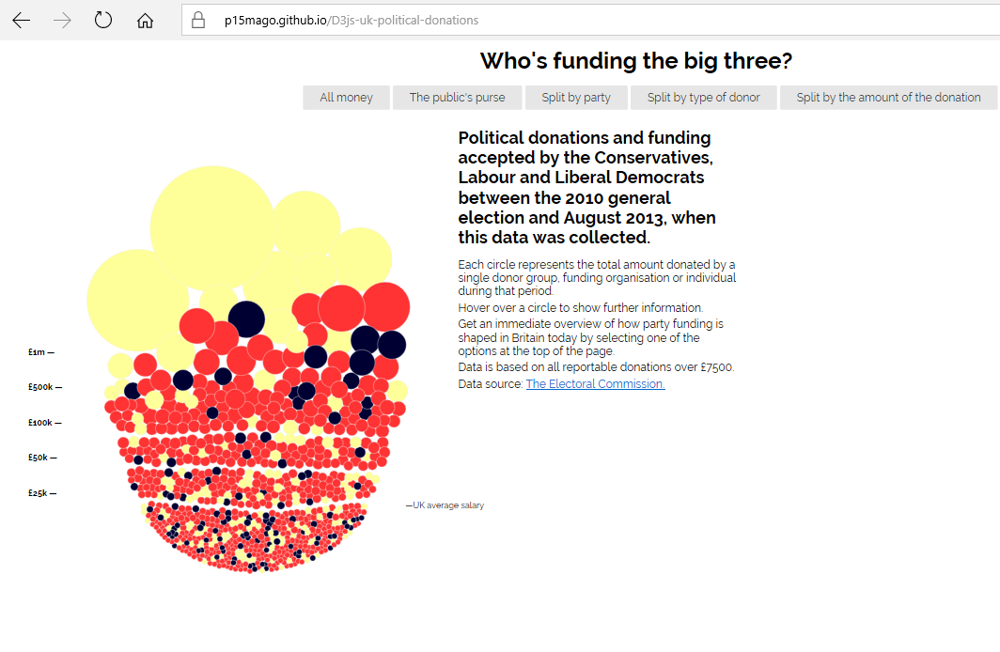
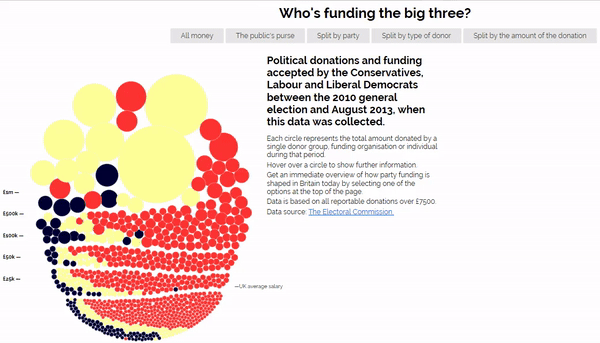
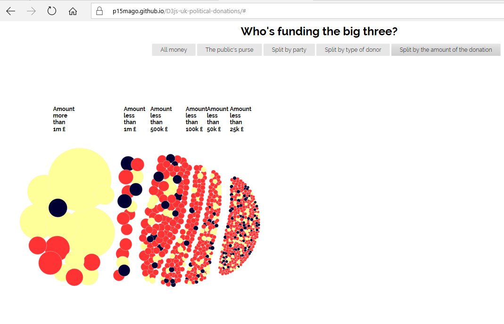
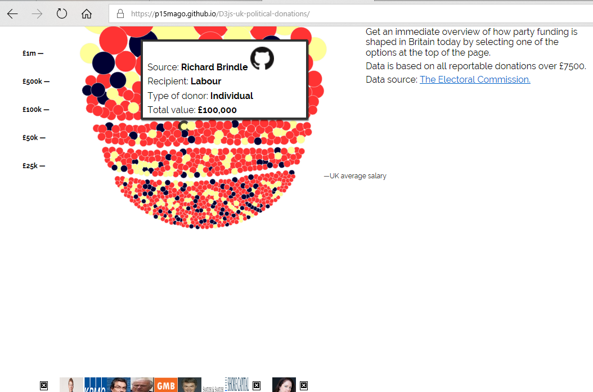
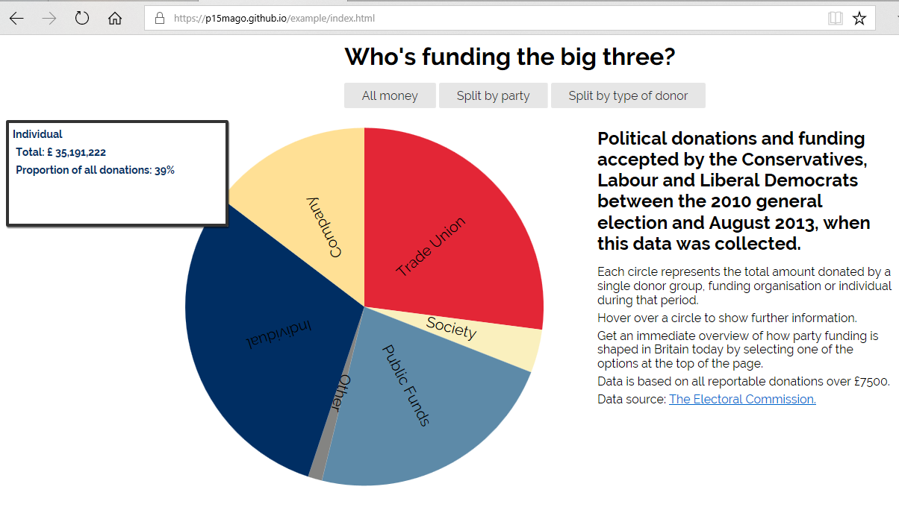
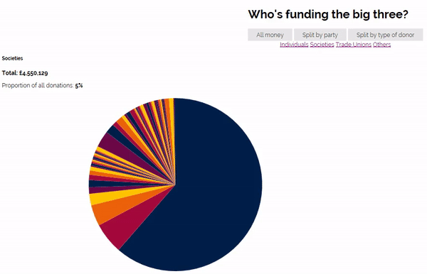

# Μάθημα: Τεχνολογία Λογισμικού

### Δήλωση και δέσμευση θέματος εργασίας στο μάθημα Τεχνολογία Λογισμικού
* Ονοματεπώνυμο: **Μαγουνάκη Ουρανία**
* Αριθμός Μητρώου: **Π2015140**
* Θέμα Εργασίας: **"Οπτικοποίηση δεδομένων χορηγιών (UK)**
* Προσωπικό αποθετήριο του κώδικα: [Link Αποθετηρίου Κώδικα](https://github.com/p15mago/D3js-uk-political-donations)
* Link για το εκτελέσιμο: [Link Εκτελέσιμου](https://p15mago.github.io/D3js-uk-political-donations/)
* Link για την οπτικοποίηση των ίδιων δεδομένων με την χρήση άλλου διαγράμματος:

## Εισαγωγή


## Σύνοψη
Η παρούσα εργασία αφορά την οπτικοποίηση των στατιστικών στοιχείων δωρεών που έχουν γίνει σε πολιτικά κόμματα της Μεγάλης Βρετανίας. Σκοπός της εργασίας είναι η εξοικείωση με την βιβλιοθήκη D3 της javascript χρησιμοποιώντας τις σελίδες github pages καθώς και η αξιοποίηση της προκειμένου οι πληροφορίες της ιστοσελίδας να προσαρμοστούν στις ανάγκες των αναγνωστών με προβλήματα όρασης. Επιπλέον, γίνεται χρήση και άλλων γλωσσών προγραμματισμού διαδικτύου ( **_css_**, **_html_**) προκειμένου να γίνουν οι απαραίτητες αλλαγές που απαιτούνται. Συγχρόνως, επισημαίνεται η δημιουργία ενός ακόμη D3 διαγράμματος οπτικοποίησης των ίδιων δεδομένων. Παρακάτω παρουσιάζονται λεπτομερώς οι αλλαγές που έγιναν καθώς και ορισμένες διευκρινίσεις.


## Aνάλυση σχετικών έργων και εργαλείων

## Mέθοδος και Tεχνικές Aνάπτυξης
Αρχικά, τονίζεται ότι ο κώδικας που χρησιμοποιήθηκε βασίζεται στην εργασία [Data Visualization](https://github.com/ioniodi/D3js-uk-political-donations) καθώς και στην [Pie Chart](https://bl.ocks.org/mbostock/3887235) η οποία συνέβαλλε στην δημιουργία ενός ακόμη **D3** γραφήματος των ίδιων δεδομένων.  Οι αλλαγές για το **πρώτο παραδοτέο** της εργασίας είναι οι εξής:

Η αλλαγή στα χρώματα από τις μπάλες έγινε με την τροποποίηση στην συγκεκριμένη γραμμή κώδικα του αρχείου [chart.js](https://github.com/p15mago/D3js-uk-political-donations/blob/gh-pages/chart.js) όπως φαίνεται παρακάτω 
```javascript
var fill = d3.scale.ordinal().range(["#FFFF99", "#FF3333", "#000033"]);
```
ενώ η αλλαγή των χρωμάτων στα αντίστοιχα πεδία της ομαδοποίησης **_Split by Party_** έγινε στο αρχείο [style.css](https://github.com/p15mago/D3js-uk-political-donations/blob/gh-pages/style.css) και συγκεκριμένα στα εξής πεδία.
```css
#conservative {
    background: rgba(255, 51, 51, 0.4);
    top: 110px;
}

#labour {
    background: rgba(255, 255, 153, 0.4);
    top: 330px;
}

#libdem {
    background: rgba(0, 0, 51, 0.4);
    top: 550px;
}
```

**_Η παρακάτω εικόνα απεικονίζει την αλλαγή των χρωμάτων:_**

Επιπλέον, προστέθηκε το αρχείο **button_sound.mp3** ώστε κάθε φορά που ο χρήστης της εφαρμογής κάνει κλίκ σε μία από τις επιλογές/κουμπιά ομαδοποίησης των δεδομένων να ακούγεται ο χαρακτηριστικός ήχος. Η συγκεκριμένη ενέργεια επιτεύχθηκε με την δημιουργία μιας νέας συνάρτησης **playSound** στον κώδικα [index.html](https://github.com/p15mago/D3js-uk-political-donations/blob/gh-pages/index.html) η οποία αναπαραγάγει τον ήχο.

```html
<audio id="sound" src="button_sound.mp3"></audio>
    <a onclick = "playSound();"></a>
    <script>
        function playSound() {
          var sound = document.getElementById("sound");
          sound.play();
      }
    </script>
```
```html
<li><a href="#" role="button" class="pure-button switch" id="all-donations" onclick = "playSound()">All money</a></li>
```
Επίσης, για την αναζήτηση του κάθε δωρητή στο **google** δημιουργήθηκε κατάλληλη συνάρτηση στο αρχείο [chart.js](https://github.com/p15mago/D3js-uk-political-donations/blob/gh-pages/chart.js) ώστε να ανοίγει καινούργιο παράθυρο με τα αποτελέσματα όταν γίνεται κλίκ στην κάθε μπάλα.
```javascript
function search(d) { //search function 

	var donor=d.donor;
	window.open("https://www.google.com/search?q=" + donor);

}
```
Συγκεκριμένα αφού δημιουργήθηκε η συνάρτηση τοποθετήθηκε το παρακάτω κομμάτι κώδικα στην συνάρτηση **start** στο ίδιο αρχείο προκειμένου να επιτευχθεί η αναζήτηση όταν γίνεται κλίκ.
```javascript
.on("click",search);
```
Επιπρόσθετα, χρησιμοποιώντας την κλάση **zoom** που δημιουργήθηκε, το ποντίκι λειτουργεί ως μεγεθυντικός φακός όταν μεταφέρεται πάνω από τις λέξεις του κειμένου. Στην περίπτωση **Split by Party** μεγεθύνεται το κάθε πεδίο ξεχωριστά.
```html
 <style type="text/css">

        .zoom:hover {

	-moz-transform: scale(1.5);

        -ms-transform: scale(1.5); /* IE 9 */

        -webkit-transform: scale(1.5); /* Safari 3-8 */

        transform: scale(1.5);        /* (150% zoom)*/

}
</style>
```
**_Π.χ_**
```html
<h3 class="zoom">Income for each party from private sources.</h3
```
**_Παρακάτω παρουσιάζεται σχετικό gif με την αναζήτηση και την μεγέθυνση των γραμμάτων:_**


Ακόμη, όταν το ποντίκι βρίσκεται μέσα στον κύκλο κάποιου δωρητή ακούγεται η ονομασία του και το ποσό της δωρεάς. Αυτό επιτυγχάνεται με την χρήση της **ResponsiveVoice** στο αρχείο [chart.js](https://github.com/p15mago/D3js-uk-political-donations/blob/gh-pages/chart.js).
```javascript
responsiveVoice.speak(donor + " " + amount + "£","UK English Male",{volume: 1}); //Βρίσκεται εντός της mouseover 
```
Όταν το ποντίκι δεν βρίσκεται πάνω στις μπάλες των δεδομένων τότε δεν ακούγεται η ονομασία και το ποσό της δωρεάς, αυτό επιτυγχάνεται με την συνάρτηση **_cancel()_** εντός της **mouseout**.
```javascript
responsiveVoice.cancel(); 
```
Ωστόσο, για να χρησιμοποιηθεί για μη διαφημιστικούς λόγους πρέπει να εισαχθεί στον κώδικα [index.html](https://github.com/p15mago/D3js-uk-political-donations/blob/gh-pages/index.html) :
```html
<script src='https://code.responsivevoice.org/responsivevoice.js'></script>
```
Εν κατακλείδι, για την τελευταία αλλαγή δημιουργήθηκε μία ακόμη επιλογή ομαδοποίησης των δεδομένων (**_Split by the amount of the donation_**) η οποία κατηγοριοποιεί τις δωρεές με βάση το χρηματικό ποσό. Οι τροποποιήσεις για το συγκεκριμένο ερώτημα πραγματοποιήθηκαν σε όλα τα αρχεία.

Παραδείγματος χάριν ένα απόσπασμα από τον κώδικα που δημιουργήθηκε για το ζητούμενο.
```javascript
function amounts(e) {
	node.each(moveToAmounts(e.alpha));
		node.attr("cx",function(d) {return d.x; })
			.attr("cy", function(d) {return d.y; });
}
```
**_Παρακάτω απεικονίζεται η νέα ομαδοποίηση:_**

Επισημαίνεται η δημιουργία ενός αρχείου **.csv** με τα στοιχεία μου καθώς και προσθήκη 5 εικόνων από δωρητές. Συγκεκριμένα οι εικόνες των δωρητών που προστέθηκαν είναι οι εξής : **Bloomberg**, **Addison Lee**, **RAB Capital**, **Soneva** και **Vitabiotics**.

Όσον αφορά το **δεύτερο παραδοτέο** τονίζεται ότι δεν υλοποιήθηκαν όλα τα ζητούμενα. Συγκεκριμένα, για το πρώτο ζητούμενο προστέθηκε κώδικας στο [chart.js](https://github.com/p15mago/D3js-uk-political-donations/blob/gh-pages/chart.js) ώστε να εμφανίζονται  οι εικόνες των δωρητών όταν το ποντίκι εισέρχεται σε κάποιον κύκλο του γραφήματος. 
```javascript
var image = document.createElement("img");

	image.src = imageFile;  
	
	image.width = 42; //διαστάσεις
	
	image.height = 42; //διαστάσεις

	document.getElementById("image_donors").appendChild(image);//appends a node as the last child of a node.
```


Παράλληλα, όπως προαναφέρθηκε, υλοποιήθηκε η δημιουργία ενός ακόμη γραφήματος (**_Pie chart_**) απεικόνισης των ίδιων δεδομένων. Στην νέα οπτικοποίηση ο κώδικας διασπάστηκε σε ξεχωριστά αρχεία **html** για να είναι πιο ευανάγνωστος σε άλλο [αποθετήριο](https://github.com/p15mago/example). Η πρώτη σελίδα ομαδοποιεί τα δεδομένα με βάση το **_entityname_** ενώ οι πληροφορίες που εμφανίζονται σε κάθε **tooltip** έχουν χρώματα αντίστοιχα με το κάθε κομμάτι [index.html](https://github.com/p15mago/example/blob/master/index.html).



Για την ομαδοποίηση **_Split by type of donor_** δημιουργήθηκαν τρία κουμπία ώστε κάθε κουμπί να οδηγεί στην αντίστοιχη κατήγορία ( **_Societies,Individuals,Trade Unions_** και **_Others_** )  όπως φαίνεται παρακάτω. Όπως και στην πρώτη σελίδα, τα ονόματα των δωρητών έχουν το ίδιο χρώμα με τo αντίστοιχο κομμάτι προκειμένου να είναι πιο εμφανές το κομμάτι που αντιστοιχεί στον κάθε δωρητή. Οι κώδικες για την συγκεκριμένη ομαδοποίηση περιλαμβάνονται στα αρχεία [index2.html](https://github.com/p15mago/example/blob/master/index2.html),  [Individual.html](https://p15mago.github.io/example/Individual.html), [Union.html](https://github.com/p15mago/example/blob/master/Union.html), [Other.html](https://github.com/p15mago/example/blob/master/Other.html).



Καταληκτικά, στην τελεταία ομαδοποίηση (**_Split by party_**) η κάθε πίτα με τα δεδομένα εμφανίζεται πάλι σε ξεχωριστή σελίδα ανάλογα με την κατηγορία ([labour.html](https://github.com/p15mago/example/blob/master/labour.html), [con.html](https://github.com/p15mago/example/blob/master/con.html), [Lib_Dem.html](https://github.com/p15mago/example/blob/master/Lib_Dem.html))

Στο αρχείο [index](https://github.com/ioniodi/D3js-uk-political-donations/blob/master/participants/index.html) στην 20η θέση περιλαμβάνεται ο κώδικας προκειμένου να εμφανίζονται τα στοιχεία ( **github username** & **picture** ) μου με κίνηση, διαφορετική από εκείνη του υποδείγματος.
## Συμπεράσματα

## _Βιβλιογραφία_

